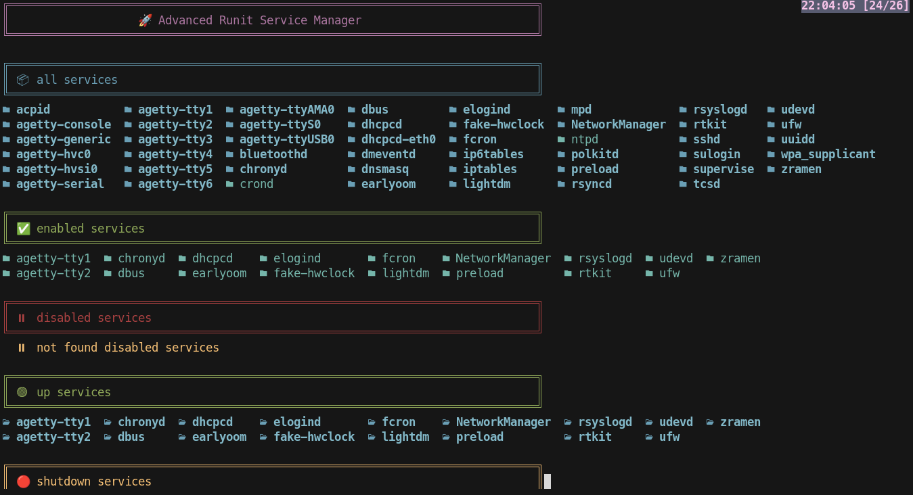
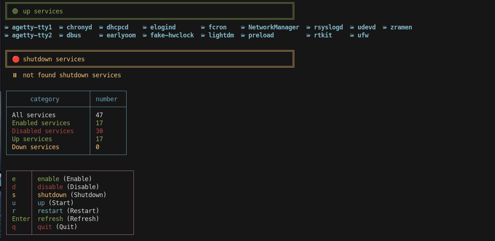
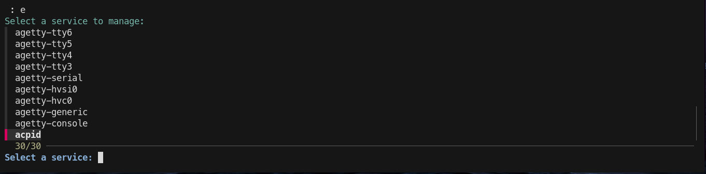

# 🚀 Advanced Runit Service Manager

A beautiful, efficient, and interactive terminal-based service manager for Rinit systems.

## ✨ Features

- 🎨 **Beautiful UI** - Colorful terminal interface with emojis and organized tables
- ⚡ **Real-time Monitoring** - Instant service status updates
- 🔄 **Smart Caching** - SHA256-based caching system for optimal performance
- 📊 **Service Categorization** - Automatic classification of services:
  - 🟢 Up & Running
  - 🔴 Down & Failed  
  - ⏸️ Disabled
  - ✅ Enabled
  - 📦 All Services
- 🎯 **Interactive Management** - Fuzzy-finder service selection with `fzf`
- 🛡️ **Safe Operations** - Root privilege checks and proper cleanup

## Images 







## 🏗️ Architecture
```
main.sh (Controller)
├── new_services.sh (UI & Service Management)
└── hash.sh (Caching System)

```

## 📦 Dependencies

- `sudo` - Privilege escalation
- `sv` - Runit service management
- `fzf` - Fuzzy finder for interactive selection
- `eza` - Enhanced file listing with icons
- `sha256sum` - Hash calculations for caching

## 🚀 Installation

1. Clone or download the scripts:
```
#mkdir
mkdir -p ~/scripts/services/

# Place all script files in this directory

#Make scripts executable:
chmod +x ~/scripts/services/*.sh

#Run the main script:
~/scripts/services/main.sh
```

🎮 Usage
Main Interface
The system provides an interactive interface with these options:

```

┌──────┬───────────────────────────┐
│ e    │ enable service            │
│ d    │ disable service           │
│ s    │ shutdown service          │
│ u    │ start service             │
│ r    │ restart service           │
│ Enter│ refresh display           │
│ q    │ quit                      │
└──────┴───────────────────────────┘
```

Service Management
Press the key for desired action (e, d, s, u, r)

Select service from interactive fzf list

Operation executes immediately

Status updates in real-time

📁 Directory Structure
```

~/scripts/services/work/
├── disabled_dir/    # Symbolic links to disabled services
├── up_dir/          # Symbolic links to running services  
├── down_dir/        # Symbolic links to stopped services
└── hash/            # Cache files for performance
```

🔧 Core Functions
nowserv()
Scans and categorizes all services

Detects running, stopped, and disabled services

Updates service status arrays

mkserv()
Creates symbolic links in work directories

Organizes services by status

Maintains directory structure

cashe()
Implements smart caching with SHA256 hashes

Detects service changes automatically

Optimizes directory updates

print-sum()
Displays beautiful service overview

Shows statistics and counts

Provides interactive menu

🛡️ Safety Features

✅ Root privilege prevention

✅ Sudo password validation

✅ Resource cleanup on exit

✅ Dependency verification

✅ Signal handling (INT, TERM, EXIT)

🎨 UI Components
Service Display
Color-coded service categories

Gradient directory listings with eza

Organized table statistics

Emoji indicators for status

Statistics Panel
```
┌──────────────────────┬─────────┐
│      category        │ number  │
├──────────────────────┼─────────┤
│ All services         │ 45      │
│ Enabled services     │ 32      │
│ Disabled services    │ 13      │
│ Up services          │ 28      │
│ Down services        │ 4       │
└──────────────────────┴─────────┘
```

🔄 Caching System
The hash-based caching:

Stores service state fingerprints

Compares current vs previous states

Only updates directories when changes detected

Uses SHA256 for reliable change detection

🚨 Troubleshooting
Common Issues
Missing Dependencies: Install required packages

Permission Denied: Ensure sudo access works

Service Not Found: Check runit service directories

Dependency Installation


```
void
sudo xbps-install fzf eza 
```


🤝 Contributing
This is a personal project optimized for:

🎯 Individual use cases

⚡ Quick service management

🎨 Visual appeal in terminal

🔧 Easy customization

📄 License

## 📄 License

This project is licensed under the GNU General Public License v3.0 - see the [LICENSE](LICENSE) file for details.


